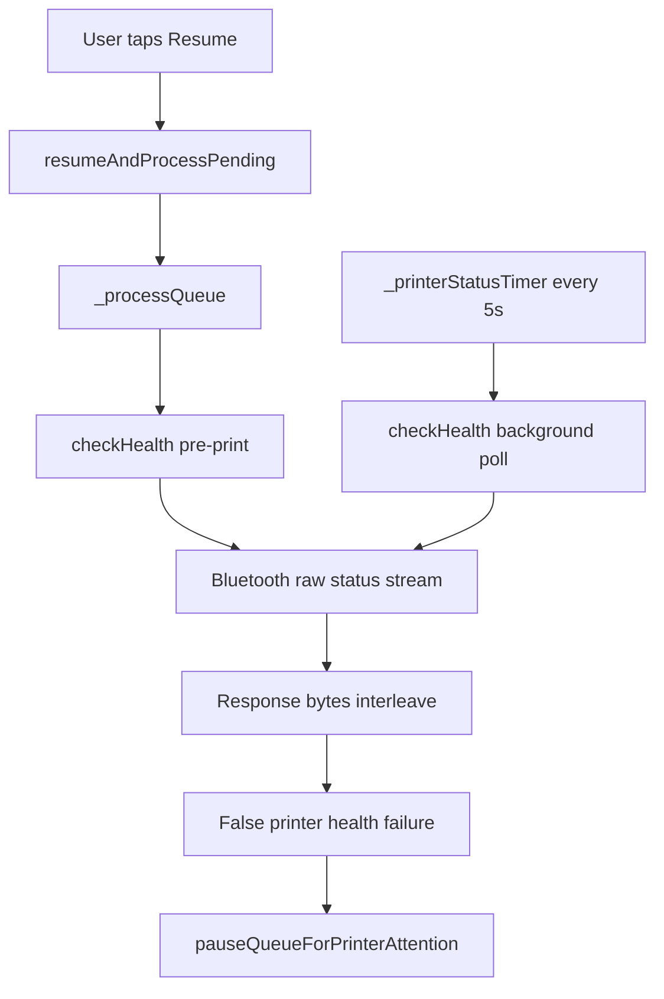

# CASE_FILE — Resume Pending Crash / Printer Health Race

## Scope
- App: `woosoo-print-bridge`
- Area: queue resume flow, printer health polling, LAN IP detection
- Date: 2026-05-01

## Incident Summary
Two user-visible faults were investigated:
1. LAN IP detection preferred `192.168.100.42` instead of the expected current Pi host `192.168.100.7`.
2. Tapping **Resume and process pending** could surface a Flutter crash/red-screen and immediately re-pause the queue.

## Root Causes

### 1. LAN IP detection drift
- `_getDeviceLanIp()` selected the first non-loopback IPv4.
- On Windows with Docker/WSL/Hyper-V adapters, virtual interfaces could appear before the physical NIC.
- `192.168.100.42` is now the Windows host IP, while the Pi backend moved to `192.168.100.7`.
- SharedPreferences also still contained stale `apiBaseUrl=https://192.168.100.42`.

### 2. Resume-pending crash chain
- **Bug A**: `queue_screen.dart` invoked `ctrl.resumeAndProcessPending()` fire-and-forget, so async exceptions escaped as unhandled Future errors.
- **Bug B**: `_printerStatusTimer` called `printer.checkHealth()` concurrently with active print-path health checks. Both paths subscribe to the same Bluetooth raw stream and can consume each other’s DLE EOT response bytes.
- **Bug C**: `resumeAndProcessPending()` had no re-entrancy guard, so multiple overlapping resume requests could stack duplicate queue passes behind the shared lock.

## Event Flow

## Fixes Applied
- Hardened `_getDeviceLanIp()` to prefer physical adapters and only fall back to virtual adapters if needed.
- Added guarded async handling to the queue-screen resume button so errors are surfaced to the operator instead of crashing the debug session.
- Skipped background printer-health polling while any job is in `printing` state.
- Added a re-entrancy guard so `resumeAndProcessPending()` reuses the same in-flight operation.

## Runtime Follow-up Required
- Update **Settings → API Base URL** to `https://192.168.100.7` on the device if it still shows `.42`.

## Validation Target
- `dart analyze lib`
- Manual operator test: resume pending jobs while printer/network/websocket show connected, confirm no crash and no instant re-pause caused by background health polling.
